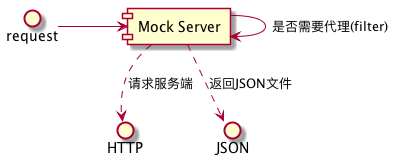

## MOCK服务代理

### 调用过程

<div style="display: none;"> 
@startuml uml/请求过程.png
request -> [Mock Server] 
[Mock Server] -> [Mock Server] : 是否需要代理(filter)
[Mock Server] ..> HTTP : 请求服务端
[Mock Server] ..> JSON : 返回JSON文件
@enduml
</div>

### 安装运行
1. 配置filter.properties，指定需要mock的服务地址
2. 配置config.properties，指定需要代理的服务地址及本地端口
3. 直接执行bin目录下对应系统的可执行文件，至此，代理服务启动
4. 访问本地端口即可代理远程服务

### 文件说明
1. bin/filter.properties 用来指定需要mock的地址。没有被mock的地址将会访问代理服务，并返回真实响应
    - 支持path配置，如：/shop/{shop}/test
2. bin/config.properties mock服务配置，支持多服务代理
3. bin/mock-** mock服务启动文件

### 配置
1. 本地程序只需要访问http://localhost:8888就可以实现代理
````
# 代理服务器地址
proxy_url=https://auth-test.1000sails.com/dpos-auth-web/s/
# 代理延迟返回
proxy_delay=3000
# 本地响应目录，其内部目录结构必须与请求地址相同
response_dir=lion
# mock服务对应的本地端口
port=8888
# 默认cookie，启用时会覆盖服务端的cookie
#cookie=ddddd
````

2. 支持多服务配置
````
# 代理服务器地址
proxy_url.shop=https://www.baidu.com/
# 代理延迟返回
proxy_delay.shop=3000
# 本地响应目录，其内部目录结构必须与请求地址相同
response_dir.shop=dpos
# mock服务对应的本地端口
port.shop=8989
# 默认cookie，启用时会覆盖服务端的cookie
#cookie.dpos=ddddd
````

### 测试
1. 运行bin/mock-**可执行文件
2. 访问http://localhost:8989/shop/8888/test，等待3秒，确认是否返回了以下内容
````
{
    "test": "11111"
}
````
3. 访问http://localhost:8989，等待3秒，确认是否返回了百度错误页面

### 编译(本项目维护人员执行)
````
CGO_ENABLED=0 GOOS=windows GOARCH=386 go build -o ../../bin/mock-win32.exe 
CGO_ENABLED=0 GOOS=windows GOARCH=amd64 go build -o ../../bin/mock-win64.exe
CGO_ENABLED=0 GOOS=linux GOARCH=amd64 go build -o ../../bin/mock-linux64 
go build -o ../../bin/mock-mac
````